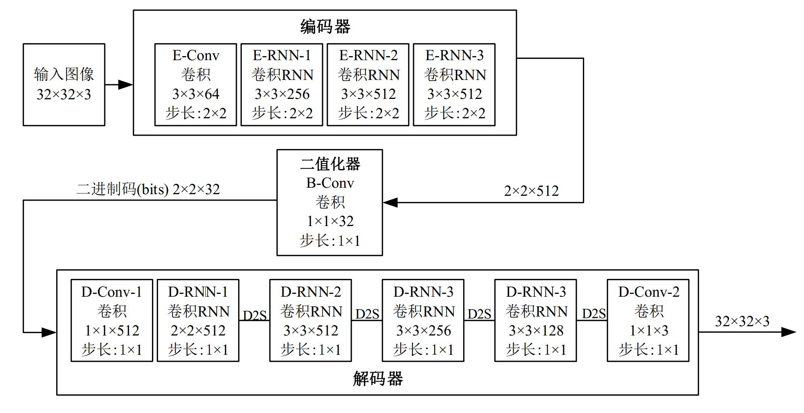

# Image-Compression-based-on-LSTM-network
*Bachelor Graduation Project: Image Compression based on LSTM-pytorch implementation  
*Zhe(Jack) Xu  

## Requirements
- PyTorch 0.2.x
- GPU is recommended when you wish to train from the scratch.
- If you have got your trained file(decoder/encoder_epoch_XXX.pth),CPU can also work efficiently.

## Train
`
python train.py -f /path/to/your/images_folder
`  
I used MS-COCO 2014 Dataset to train.After training,you will get your encoder and decoder .pth file.

## Encode and Decode
### Encode(After Training)
`
python encoder.py --model checkpoint/encoder_epoch_00000066.pth --input /path_to_your_photo.png --cuda --output ex --iterations 16
`  
*encoder_epoch_000000XX.pth - this file name depends on your training process.
This will output binary codes saved in `.npz` format.
You can set your own 'iterations' number. 

### Decode(After Training)
`
python decoder.py --model checkpoint/decoder_epoch_00000066.pth --input /path_to_your_photo.npz --cuda --output /path_to_output_folder
`  

This will output images of different quality levels.

## Test
### Get Kodak dataset
Using the pictures in test_pic folder.

### Encode and decode with RNN model
```bash
bash test/enc_dec.sh
```
*you can also use the encoder and decoder above.

### Encode and decode with JPEG (use `convert` from ImageMagick)
```bash
bash test/jpeg.sh
```
Want to compare with JPEG Method so I used JPEG.

### Calculate MS-SSIM and PSNR
See the detail in PSNR and MS-SSIM folder

### `network`

Network Outline



## Result


## What's inside
- `train.py`: Main program for training.
- `encoder.py` and `decoder.py`: Encoder and decoder.
- `dataset.py`: Utils for reading images.
- `metric.py`: Functions for Calculatnig MS-SSIM and PSNR.
- `network.py`: Modules of encoder and decoder.
- `modules/conv_rnn.py`: ConvLSTM module.
- `functions/sign.py`: Forward and backward for binary quantization.

